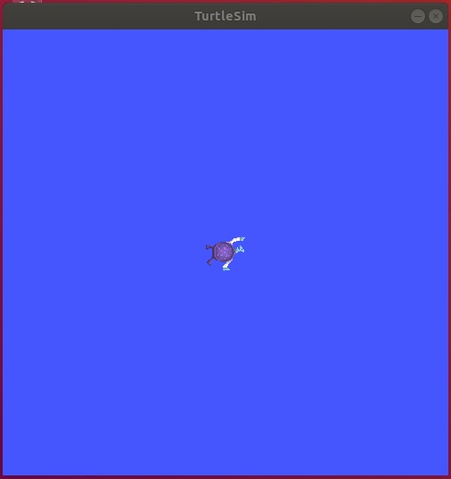

# 4. 作ってみよう

この章ではROSのチュートリアルでよく使われるturtlesimを使ってROSのノードを作る演習をしてもらいます。

## 4-1 turtlesimのインストールと実行方法

### 4-1-1 インストール方法

以下のコマンドでturtlesimをインストールします。

```shell
sudo apt install ros-dashing-turtlesim
```

インストールされたことを確認するために, 以下のコマンドを入力します。インストールできていれば, 上のコマンドでturtlesimパッケージの実行可能なコマンドが表示されます。

```shell
$ ros2 pkg executables turtlesim
turtlesim draw_square
turtlesim mimic
turtlesim turtle_teleop_key
turtlesim turtlesim_node
```

### 4-1-2 turtlesimを実行

ターミナルで以下を実行してください。

[端末A]

```shell
$ ros2 run turtlesim turtlesim_node
[INFO] [turtlesim]: Starting turtlesim with node name /turtlesim
[INFO] [turtlesim]: Spawning turtle [turtle1] at x=[5.544445], y=[5.544445], theta=[0.000000]
```

下図のようにカメの絵がポツンと表示された画面が出ると思います。



もう一つ、新しいターミナルを開き, 以下を実行してください。

[端末B]

```shell
ros2 run turtlesim turtle_teleop_key
```

矢印キーを適当に押してみてください。ウィンドウの中のカメが動き出すはずです。

## 4-2.調べる

まずはどんなTopicがあるかを見てみましょう。
以下を実行してみてください。listサブコマンドは'-t'オプションをつけることで型を表示することができます。

```shell
$ ros2 topic list -t
/parameter_events [rcl_interfaces/msg/ParameterEvent]
/rosout [rcl_interfaces/msg/Log]
/turtle1/cmd_vel [geometry_msgs/msg/Twist]
/turtle1/color_sensor [turtlesim/msg/Color]
/turtle1/pose [turtlesim/msg/Pose]
```

おそらく名前からして"/turtle1/cmd_vel"がカメを操作するためのトピックのようですね。型はgeometry_msgs/msg/Twistと書いてあります。

それでは、どんな値がパブリッシュされているか調べてみましょう。 ```ros2 topic echo```コマンドを使うと、トピックにパブリッシュされている値を見ることができます。

以下のコマンドを実行して[端末B]で矢印キーを押すと以下のような結果になると思います。

```shell
$ ros2 topic echo turtle1/cmd_vel
#↑キーを押したとき
linear:
  x: 2.0
  y: 0.0
  z: 0.0
angular:
  x: 0.0
  y: 0.0
  z: 0.0
---
#←キーを押したとき
linear:
  x: 0.0
  y: 0.0
  z: 0.0
angular:
  x: 0.0
  y: 0.0
  z: 2.0
---
```

カメが前進するときにはlinearのxに2.0、回転するときはangularのzに2.0が入るようですね。

以上の情報を踏まえて、以下の演習問題を行ってみてください。

**注意**：演習問題を始める前に4_excercise/COLCON_IGNOREをリネームもしくは削除してください。

## 4-3. 演習問題 1

4_excercise/turtle_circle に正常に動作しない,Publisherのコード設置してあります。
コードを書き足して、カメが円運動を繰り返するようにしてみてください。

## 4-4. 演習問題 2

1. turtle_simにはアクションが定義されています。```ros2 action list -t```コマンドを実行して型を調べてみましょう。
2. 調べたアクショントピックの型を```ros2 action show```に引数として与えて、型の定義を確認しましょう。
3. 4_excercise/turtle_polygonに問題回答用のパッケージを作成してあります。コードを編集してカメを動かすためのアクションクライアントを作ってみましょう。```ros2 action send_goal```が助けになるはずです。
4. アクションクライアントとトピックを組み合わせて、カメに四角形を描かせるノードを作ってみましょう

(演習問題2がどうしても回答できない場合には4_excercise/turtle_polygon_answerに回答の例を設置してありますので、参考にしてください。)
